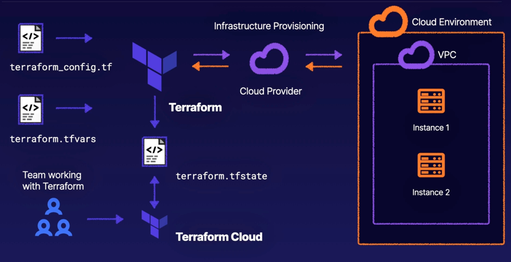
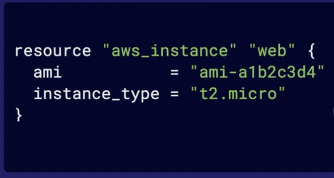
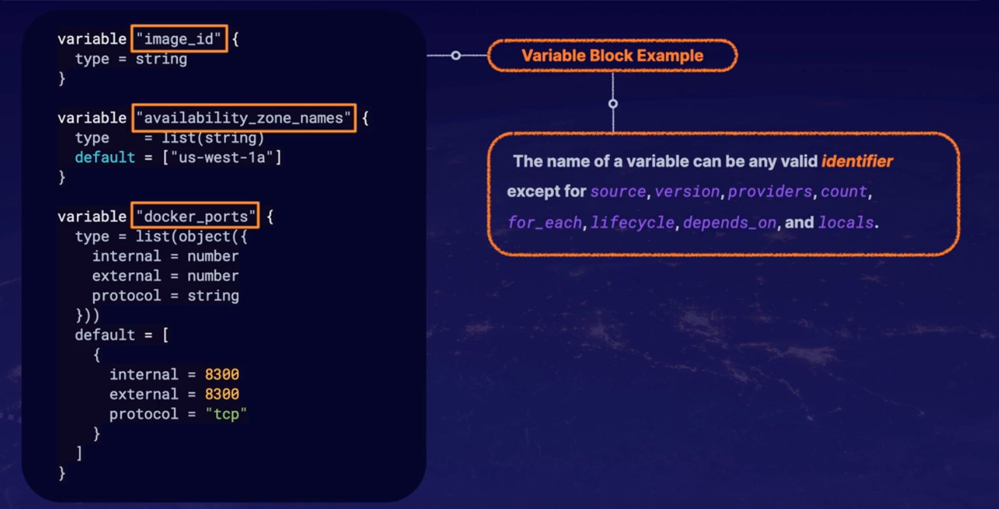

# Introduction to Terraform

* Tool for building, changing, and versioning infrastructure safely and efficiently, locally or in the cloud.

## Terraform Architecture



## Install terraform in mac OS

* Install home brew
    * /bin/bash -c "$(curl -fsSL https://raw.githubusercontent.com/Homebrew/install/HEAD/install.sh"
    * brew upgrade

* Install terraform
    *brew install terraform
    * terraform --help (to make sure it is installed)
    * touch ~/.bashrc
    * terraform -install-autocomplete

## Terraform CLI

* [Terraform CLI Documentation](https://www.terraform.io/cli)

* [Terraform Cheatsheet](Resources/TerraformCheatsheet.pdf)

## Terraform language

* Main purpose is to declare resources. This represents infrastructure objects.

* Syntax consists of:
    * Blocks - Containers for objects like resources.

    * Arguments - Assign a value to a name.

    * Expressions - Represent a value.


## Working with resources

* Resource blocks describes infrastructure objects like virtual networks, compute resources, or components like DNS records.



* Meta Arguments - Can be used with resource types to change the behaviour of resource.

    * depends_on - Specify hidden dependecies.
    * count - create multiple resource instances according to a count.
    * for_each - create multiple instance according to a map or a set of strings.
    * provider - Select a non-default provider config.
    * lifecycle - set lifecycle customizations.
    * Provisioner or connection - Take extra actions after resource creation.

## How configuration is applied

* Create
* Destroy
* Update in-place
* Destroy and re-create

## Input Variables

* Input variables are like function arguments. they allow aspects of the module to be customized without altering the actual module. This allows modules to be shared between different configurations.



* Optional Argument for Variable Declaration

    * default
    * type
    * description
    * validation
    * sensitive

* Type Constraint
    * string
    * number
    * bool

* Type Constructors
    * list
    * set
    * map
    * object
    * tuple

* Argument Example:

    ```
        variable "image_id" {
            type = string
            description = "The id of the machine image (AMI) to use for the server."
        }
    ```

* Custom Validation Rules

    ```
        variable "image_id" {
            type = string
            description = "The id of the machine image (AMI) to use for the server."

            validation {
                condition = length(var.image_id) > 4 && substr(var.image_id, 0, 4) == "ami-"
                erro_message = "The image_id value must be a valid AMI id, starting with \"ami-\"."
            }
        }

    ```
* The order in which variables are loaded
    * Environment Variables
    * teraform.tfvars
    * terraform.tfvars.json
    * *.auto.tfvars or *.auto.tfvars
    * Any command-line options like -var and -var-file.

## Decalring Output Variables

* Are like return values.