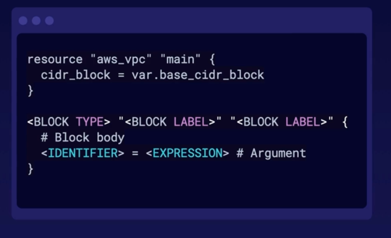

# Introduction to Terraform

* Tool for building, changing, and versioning infrastructure safely and efficiently, locally or in the cloud.

## Terraform Architecture

* Source Image - A Cloud Guru

## Install terraform in MAC OS

* Install home brew
    * /bin/bash -c "$(curl -fsSL https://raw.githubusercontent.com/Homebrew/install/HEAD/install.sh"
    * brew upgrade

* Install terraform
    *brew install terraform
    * terraform --help (to make sure it is installed)
    * touch ~/.bashrc
    * terraform -install-autocomplete

## Terraform CLI

* [Terraform CLI Documentation](https://www.terraform.io/cli)

* [Terraform Cheatsheet](Resources/TerraformCheatsheet.pdf)

## Terraform language

* Main purpose is to declare resources. This represents infrastructure objects.

* Syntax consists of:
    * Blocks - Containers for objects like resources.

    * Arguments - Assign a value to a name.

    * Expressions - Represent a value.

